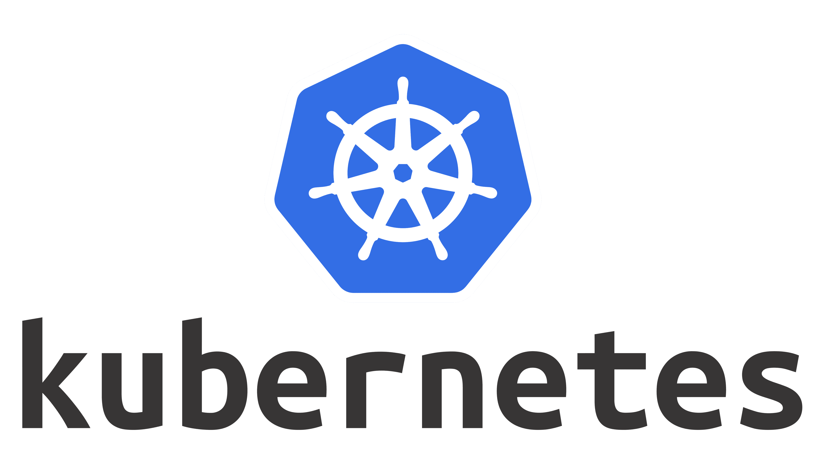
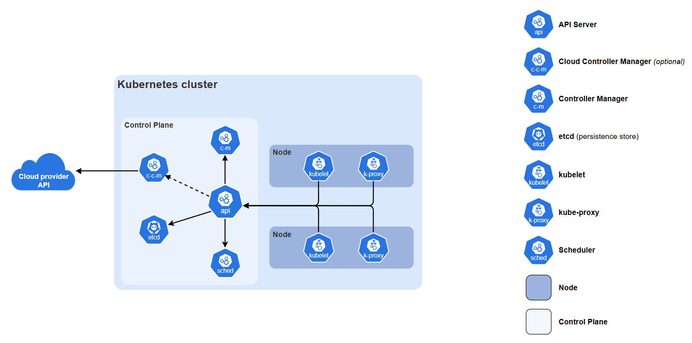

+++
title = 'Kubernetes 클러스터는 어떻게 만들어질까: 구성 요소와 구축 도구의 역할'
date = 2026-07-03T11:00:00+09:00
draft = true
description = 'Kubernetes의 기본 구조와 VirtualBox, Vagrant, containerd, kubeadm, Kubespray, kind 등 클러스터 구축 과정에 등장하는 도구의 역할을 구분합니다.'
categories = ['Infrastructure']
tags = ['Kubernetes', 'kubeadm', 'Kubespray', 'Vagrant', 'containerd']
+++

## 시작하며

Kubernetes 클러스터를 설치하는 자료를 보면 VirtualBox, Vagrant, containerd, kubeadm, kubectl, Calico와 같은 여러 이름이 한꺼번에 등장하지만 
모두 설치 과정에 사용되지만 같은 종류의 도구는 아닙니다.

이 역할을 구분하지 않으면 스크립트 실행에는 성공해도 어떤 도구가 가상 머신을 만들었고 어떤 도구가 Kubernetes 클러스터를 구성했는지 이해하기 어렵습니다..

이 글에서는 Kubernetes의 기본 구조를 먼저 살펴보고 클러스터 구축 과정에 등장하는 도구를 계층별로 구분합니다.

## Kubernetes란



Kubernetes는 컨테이너화된 애플리케이션을 배포하고 운영하기 위한 오케스트레이션 플랫폼입니다.

사용자는 애플리케이션이 어떤 상태로 실행되어야 하는지 선언하고,
Kubernetes의 컨트롤러는 현재 상태를 관찰하고 선언한 상태와 일치하도록 지속적으로 조정합니다.

예를 들어 Deployment에 Replica를 3개로 선언하면 Kubernetes는 실행 중인 Pod 수를 확인하고 
Pod가 하나 종료되어 2개가 되면 새로운 Pod를 만들어 다시 3개로 맞춥니다.

## 클러스터의 기본 구조



Kubernetes 클러스터는 크게 Control Plane과 Worker Node로 나뉩니다.

### Control Plane

Control Plane은 클러스터 전체 상태를 관리합니다.

- `kube-apiserver`: Kubernetes API 요청을 받는 진입점
- `etcd`: 클러스터의 상태를 저장하는 데이터 저장소
- `kube-scheduler`: 새 Pod를 실행할 Node를 결정
- `kube-controller-manager`: 선언된 상태와 현재 상태를 비교하고 조정

### Worker Node

Worker Node는 실제 애플리케이션 Pod를 실행합니다.

- `kubelet`: Node에서 실행할 Pod를 관리하고 상태를 보고
- `containerd`: 컨테이너 이미지를 받고 컨테이너를 실행
- `kube-proxy`: Service 네트워크 통신을 위한 규칙 관리

Control Plane과 Worker Node는 별개의 시스템이 아니라 API Server를 중심으로 상태를 주고받습니다.

## 클러스터를 만들 때 필요한 환경과 흐름

기존 Vagrantfile을 기준으로 설치 흐름을 단순화하면 다음과 같습니다.

```text
VirtualBox
→ Vagrant
→ Rocky Linux VM
→ dnf/yum
→ containerd
→ kubelet, kubeadm, kubectl
→ kubeadm init / join
→ Calico
→ Kubernetes 클러스터
```

각 항목은 서로 다른 문제를 해결합니다.

## 가상화와 VM 구성

### VirtualBox

VirtualBox는 호스트 컴퓨터 위에서 가상 머신을 실행하는 하이퍼바이저입니다. 
CPU, 메모리, 디스크와 네트워크가 있는 가상의 서버 환경을 제공합니다.

### Vagrant

Vagrant는 VirtualBox 같은 가상화 도구를 이용해 VM 생성과 설정을 코드로 관리합니다.

Vagrantfile에는 다음 내용을 정의할 수 있습니다.

- 사용할 운영체제 이미지
- VM 이름과 개수
- CPU와 메모리
- IP 주소와 포트 포워딩
- VM 생성 후 실행할 설치 스크립트

Vagrant가 Kubernetes 클러스터 자체를 만드는 것은 아니며, Kubernetes를 설치할 Linux 서버 환경을 준비하고 설치 스크립트를 실행합니다.

## Linux 패키지 관리자

### dnf와 yum

`dnf`와 `yum`은 Rocky Linux에서 소프트웨어 패키지를 설치하고 업데이트하는 도구입니다.

기존 스크립트에서는 다음 패키지를 설치하는 데 사용됐습니다.

- containerd
- kubelet
- kubeadm
- kubectl

따라서 dnf와 yum은 Kubernetes 전용 도구가 아니라 운영체제 수준의 패키지 관리자입니다.

## 컨테이너가 실행되기까지

Kubernetes를 처음 접하면 “Kubernetes가 컨테이너를 실행한다”고 이해하기 쉽습니다. 큰 흐름에서는 맞는 표현이지만, Kubernetes가 컨테이너 프로세스를 직접 만드는 것은 아닙니다.

먼저 이미지, 컨테이너, 컨테이너 런타임을 구분할 필요가 있습니다.

### 컨테이너 이미지와 컨테이너

컨테이너 이미지는 애플리케이션 실행에 필요한 파일과 설정을 묶어 놓은 읽기 전용 템플릿입니다. Python 애플리케이션이라면 소스 코드, Python 런타임, 라이브러리와 실행 명령 등이 이미지에 포함될 수 있습니다.

이미지는 아직 실행 중인 프로그램이 아닙니다. 이미지를 이용해 프로세스를 실행한 결과가 컨테이너입니다.

```text
컨테이너 이미지: 실행에 필요한 파일과 설정
컨테이너: 이미지를 기반으로 현재 실행 중인 격리된 프로세스
```

가상 머신은 일반적으로 별도의 운영체제와 커널을 실행합니다. 반면 컨테이너는 호스트의 Linux 커널을 공유하면서 namespace와 cgroup 등을 이용해 프로세스, 네트워크와 자원을 격리합니다.

### 컨테이너 런타임

컨테이너 런타임은 이미지를 이용해 컨테이너를 생성하고 실행 상태를 관리하는 소프트웨어입니다.

주요 역할은 다음과 같습니다.

- 컨테이너 이미지 다운로드와 저장
- 컨테이너 생성, 시작, 중지와 삭제
- CPU와 메모리 같은 자원 제한 적용
- 컨테이너 실행 상태 관리
- 저수준 런타임을 통한 실제 프로세스 생성

Kubernetes Node에는 컨테이너 런타임이 필요합니다. kubelet은 어떤 Pod가 필요한지 관리하지만, 그 안의 컨테이너를 실제로 실행하는 일은 컨테이너 런타임에 요청합니다.

### containerd와 runc

containerd는 Kubernetes에서 사용할 수 있는 대표적인 컨테이너 런타임입니다.

containerd는 이미지 다운로드, 이미지 저장, 컨테이너 생성과 수명주기를 관리합니다. 
Linux의 격리 기능을 설정하고 컨테이너 프로세스를 시작하는 저수준 작업은 보통 `runc`가 담당합니다.

```text
containerd
→ 이미지와 컨테이너 수명주기 관리
→ runc 호출
→ 격리된 Linux 프로세스 생성
```

처음에는 containerd를 “이미지와 컨테이너의 전체 실행 과정을 관리하는 런타임”, runc를 “컨테이너 프로세스를 실제로 생성하는 저수준 실행기” 정도로 구분하는 것으로...

### CRI가 필요한 이유

CRI는 **Container Runtime Interface**의 약자로, kubelet과 컨테이너 런타임이 통신하기 위한 Kubernetes의 표준 인터페이스입니다.

표준 인터페이스가 없다면 kubelet은 containerd, CRI-O 등 런타임마다 서로 다른 호출 방법을 구현해야 합니다. CRI가 있기 때문에 kubelet은 동일한 방식으로 컨테이너 실행을 요청할 수 있습니다.

```text
kubelet
→ CRI 표준 요청
→ containerd 또는 CRI-O
→ 컨테이너 실행
```

여기서 각 용어의 종류를 구분하는 것이 중요합니다.

| 용어 | 의미 |
| --- | --- |
| 컨테이너 런타임 | 컨테이너를 실행하고 관리하는 소프트웨어의 종류 |
| containerd | 컨테이너 런타임의 구현체 |
| CRI | kubelet과 런타임 사이의 표준 통신 규격 |
| runc | 격리된 컨테이너 프로세스를 생성하는 저수준 런타임 |

전체 흐름을 연결하면 다음과 같습니다.

```text
사용자가 Pod 생성 요청
→ API Server에 원하는 상태 저장
→ Scheduler가 실행할 Node 결정
→ 해당 Node의 kubelet이 Pod 명세 확인
→ kubelet이 CRI를 통해 containerd에 요청
→ containerd가 이미지 준비 후 runc 호출
→ 컨테이너 프로세스 실행
```

Kubernetes가 배치와 상태 관리를 담당하고, 컨테이너 런타임이 실제 실행을 담당한다고 볼 수 있습니다.

## Kubernetes 구성 도구

### kubeadm

kubeadm은 Kubernetes 클러스터를 초기화하고 Node를 가입시키는 부트스트랩 도구입니다.

Control Plane에서는 일반적으로 다음 명령을 사용합니다.

```bash
kubeadm init
```

Worker Node에서는 `kubeadm init` 결과로 생성된 토큰과 인증 정보를 이용해 다음 명령을 실행합니다.

```bash
kubeadm join <API_SERVER>:6443 --token <TOKEN> \
  --discovery-token-ca-cert-hash sha256:<HASH>
```

kubeadm은 VM을 만들거나 운영체제 패키지를 설치하지 않으며, 방화벽, 컨테이너 런타임과 커널 설정 같은 사전 준비도 별도로 필요합니다.

### kubelet

kubelet은 각 Node에서 계속 실행되는 에이전트입니다. API Server를 통해 전달받은 Pod 명세에 따라 컨테이너 실행을 관리하고 Node와 Pod 상태를 보고합니다.

kubeadm은 클러스터를 구성하는 명령형 도구이고 kubelet은 구성된 Node에서 계속 동작하는 서비스라는 차이가 있습니다.

### kubectl

kubectl은 Kubernetes API를 사용하는 명령줄 클라이언트입니다.

```bash
kubectl get nodes
kubectl get pods -A
kubectl describe pod <POD_NAME>
```

kubectl 자체가 Pod를 직접 실행하는 것이 아니라 API Server에 요청을 보냅니다.

## Pod 네트워크와 CNI

컨테이너가 실행되었더라도 네트워크가 자동으로 완성되는 것은 아닙니다. Kubernetes에서는 여러 Node에 있는 Pod가 서로 통신할 수 있어야 하며, 각 Pod에는 클러스터 내부에서 사용할 IP 주소가 필요합니다.

예를 들어 다음 상황을 생각할 수 있습니다.

```text
Worker 1의 Pod A
→ Worker 2의 Pod B에 요청
```

두 Pod가 서로 다른 Node에 있기 때문에 다음 작업이 필요합니다.

- Pod에 IP 주소 할당
- 컨테이너 내부에 네트워크 인터페이스 생성
- Pod가 Node 밖으로 통신할 수 있도록 연결
- 다른 Node의 Pod까지 패킷이 이동할 경로 구성
- Pod가 삭제되면 네트워크 자원 정리

### CNI란

CNI는 **Container Network Interface**의 약자입니다. 컨테이너 런타임이 네트워크 플러그인을 호출하는 방법을 정의한 표준 규격입니다.

CRI가 컨테이너 실행 영역의 표준 인터페이스라면, CNI는 컨테이너 네트워크 구성 영역의 표준 인터페이스입니다.

```text
CRI: kubelet과 컨테이너 런타임의 연결 규격
CNI: 컨테이너와 네트워크 플러그인의 연결 규격
```

Kubernetes는 Pod 네트워크 구현을 하나로 고정하지 않습니다. 사용자는 환경과 요구사항에 맞는 CNI 플러그인을 선택할 수 있습니다.

대표적인 CNI 플러그인에는 다음과 같은 도구가 있습니다.

- Calico
- Cilium
- Flannel

각 도구는 네트워크 구성 방식, NetworkPolicy, 보안과 관찰 기능 등에서 차이가 있습니다.

### Calico의 역할

이 실습에서는 Calico를 사용합니다. Calico는 Pod에 네트워크를 연결하고, Node가 달라도 Pod끼리 통신할 수 있도록 경로를 구성하는 CNI 플러그인입니다. NetworkPolicy를 이용한 트래픽 제어 기능도 제공합니다.

```text
kubeadm init
→ Control Plane 구성
→ Calico 설치
→ Pod 네트워크 구성
→ Node와 CoreDNS가 정상 상태로 전환
```

`kubeadm init`은 Control Plane을 초기화하지만 Pod 네트워크 플러그인까지 자동으로 선택해 설치하지는 않습니다. CNI가 설치되지 않으면 Node가 `NotReady` 상태로 남거나 CoreDNS Pod가 정상적으로 실행되지 않을 수 있습니다.

또한 `kubeadm init`에 지정한 Pod CIDR과 Calico가 사용하는 네트워크 대역이 일치해야 합니다.

```bash
kubeadm init --pod-network-cidr=10.244.0.0/16
```

```text
kubeadm Pod CIDR: 10.244.0.0/16
Calico IP Pool:   10.244.0.0/16
```

이 두 설정이 다르면 Pod IP 할당이나 Pod 간 통신에 문제가 생길 수 있으므로, 설치 후 반드시 Node와 시스템 Pod 상태를 확인해야 합니다.

```bash
kubectl get nodes
kubectl get pods -A
```

## kubeadm, Kubespray, kind의 차이

세 도구는 모두 Kubernetes 클러스터 생성과 관련 있지만 사용 목적이 다릅니다.

| 도구 | 주요 역할 | 적합한 상황 |
| --- | --- | --- |
| kubeadm | Control Plane 초기화와 Worker 가입 | 설치 원리 학습, 직접 구축 |
| Kubespray | Ansible을 이용한 다중 Node 구축 자동화 | 온프레미스, 반복 가능한 클러스터 구축 |
| kind | 컨테이너를 Node로 사용하는 로컬 클러스터 | 개발, 테스트, CI |

Kubespray는 여러 Linux 서버의 Kubernetes 구성을 자동화합니다. 
kind는 실제 VM 대신 컨테이너를 Node로 사용해 빠르게 로컬 클러스터를 만듭니다. 
kubeadm은 서버가 준비된 상태에서 Kubernetes 구성 요소를 부트스트랩합니다.

## 기존 Vagrantfile에서 확인한 내용

기존 Vagrantfile은 다음 환경을 의도하고 있었습니다.

```text
k8s-master  : 192.168.56.30
k8s-worker1 : 192.168.56.31
k8s-worker2 : 192.168.56.32
```

공통 설치 스크립트는 각 VM에서 다음 작업을 수행합니다.

- Swap과 방화벽 비활성화
- 커널 모듈과 네트워크 파라미터 설정
- containerd 설치 및 systemd cgroup 설정
- kubelet, kubeadm, kubectl 설치

Master 전용 스크립트에서는 `kubeadm init`과 Calico 설치를 수행합니다.

다만 제공된 코드에서는 Worker Node에서 `kubeadm join`을 실행하는 부분을 확인할 수 없었습니다. VM 3대가 생성되는 것과 Kubernetes Node 3대가 클러스터에 가입하는 것은 별개의 과정입니다.

이 내용은 실제 클러스터에서 다음 명령으로 다시 확인할 예정입니다.

```bash
kubectl get nodes -o wide
```

## kubeadm을 선택한 이유

KubeReleaseLab의 첫 단계에서는 kubeadm을 사용해 클러스터 구성 과정을 확인하려고 합니다.

- 기존 Vagrant 기반 VM 환경을 활용할 수 있다.
- Control Plane 초기화와 Worker 가입 과정을 구분할 수 있다.
- containerd, kubelet과 CNI의 연결 관계를 직접 확인할 수 있다.
- 이후 Kubespray가 어떤 작업을 자동화하는지 비교할 기반이 된다.

실제 운영 환경에서는 관리형 Kubernetes나 Kubespray가 더 적합할 수 있습니다. 
이번 선택은 kubeadm 자체를 운영 표준으로 주장하기 위한 것이 아니라 Kubernetes 설치 구조를 이해하기 위한 것입니다.
